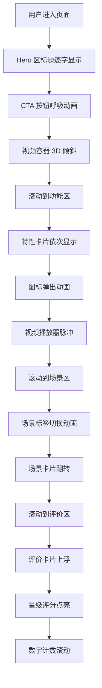

# 听脑AI官网 - 高质量动效优化方案

## 📊 当前动效分析

### 已有动效
1. **ScrollReveal** - 基础滚动显示动画（淡入+位移）
2. **路径动画** - SVG 路径描边动画（pathLength）
3. **Logo 滚动** - 企业 Logo 无限滚动
4. **下拉菜单** - 简单的透明度+位移过渡

### 存在的问题
- 动效单一，缺乏层次感
- 交互反馈不足
- 视频区域缺少吸引力
- 场景切换卡片无动效
- 按钮和卡片缺少悬停效果
- 缺少视差滚动和 3D 效果

---

## 🎨 高质量动效方案

### 1. 英雄区（Hero Section）增强

#### 1.1 标题文字动效
```
效果：逐字淡入 + 轻微弹跳
技术：Framer Motion stagger children
视觉：每个字符依次出现，营造打字机效果
```

#### 1.2 渐变背景动画
```
效果：背景渐变色缓慢流动
技术：CSS 动画 + background-position
视觉：柔和的色彩流动，增加科技感
```

#### 1.3 视频容器动效
```
效果：视频卡片 3D 倾斜 + 悬停放大
技术：transform perspective + scale
视觉：鼠标悬停时轻微 3D 旋转和放大
```

#### 1.4 CTA 按钮增强
```
效果：渐变光泽扫过 + 悬停弹性缩放
技术：伪元素动画 + spring 动画
视觉：按钮有呼吸感，吸引点击
```

---

### 2. 场景切换卡片动效

#### 2.1 标签页切换动画
```
效果：滑动指示器 + 内容淡入淡出
技术：layoutId 共享布局动画
视觉：流畅的标签切换，指示器平滑移动
```

#### 2.2 场景卡片翻转
```
效果：3D 卡片翻转显示不同场景
技术：rotateY + backface-visibility
视觉：卡片翻转展示会议/学习/销售场景
```

#### 2.3 特性列表动画
```
效果：特性图标依次弹出 + 脉冲效果
技术：stagger + scale spring
视觉：图标有节奏地出现，强调功能点
```

---

### 3. 功能展示区动效

#### 3.1 视频播放器增强
```
效果：播放按钮脉冲 + 进度条流光
技术：scale 动画 + 渐变移动
视觉：吸引用户点击播放
```

#### 3.2 特性图标动画
```
效果：图标悬停时旋转 + 背景扩散
技术：rotate + scale 组合
视觉：增加交互趣味性
```

#### 3.3 文字高亮动效
```
效果：关键词下划线动画 + 颜色渐变
技术：SVG 路径动画
视觉：强调重点信息
```

---

### 4. 用户评价卡片

#### 4.1 卡片悬停效果
```
效果：卡片上浮 + 阴影加深 + 边框发光
技术：translateY + box-shadow + border
视觉：卡片有深度感，鼠标悬停时突出
```

#### 4.2 星级评分动画
```
效果：星星依次点亮 + 闪烁效果
技术：stagger + opacity + scale
视觉：评分动态展示，更有说服力
```

#### 4.3 头像组动画
```
效果：头像依次滑入 + 重叠排列
技术：translateX + z-index
视觉：展示用户群体，增加信任感
```

---

### 5. 滚动视差效果

#### 5.1 背景层视差
```
效果：背景元素以不同速度滚动
技术：useScroll + useTransform
视觉：增加页面深度和层次感
```

#### 5.2 元素渐进显示
```
效果：元素随滚动进度逐渐显示
技术：scrollYProgress + opacity
视觉：内容随滚动自然展开
```

#### 5.3 数字滚动计数
```
效果：数字从 0 递增到目标值
技术：useSpring + 数值插值
视觉：强调数据指标，更有冲击力
```

---

### 6. 微交互动效

#### 6.1 按钮涟漪效果
```
效果：点击时产生水波纹扩散
技术：绝对定位 + scale 动画
视觉：增强点击反馈
```

#### 6.2 输入框聚焦动画
```
效果：聚焦时边框发光 + 标签上移
技术：focus 状态 + transform
视觉：提升表单交互体验
```

#### 6.3 加载骨架屏
```
效果：内容加载时的闪烁占位
技术：gradient 动画
视觉：优化加载等待体验
```

---

### 7. Logo 滚动优化

#### 7.1 无缝循环增强
```
效果：更平滑的无限滚动
技术：双倍内容 + 精确计算
视觉：完全无缝的循环效果
```

#### 7.2 悬停暂停
```
效果：鼠标悬停时暂停滚动
技术：animation-play-state
视觉：用户可以查看具体 Logo
```

#### 7.3 Logo 悬停放大
```
效果：单个 Logo 悬停时放大
技术：scale + filter
视觉：突出显示当前 Logo
```

---

### 8. 页脚动效

#### 8.1 社交图标动画
```
效果：图标悬停时弹跳 + 颜色变化
技术：translateY + color transition
视觉：增加社交媒体吸引力
```

#### 8.2 链接下划线动画
```
效果：悬停时下划线从左到右展开
技术：伪元素 + scaleX
视觉：优雅的链接交互
```

---

## 🎯 动效设计原则

### 性能优先
- 使用 `transform` 和 `opacity` 属性（GPU 加速）
- 避免触发重排（reflow）的属性
- 使用 `will-change` 提示浏览器优化
- 大型动画使用 `requestAnimationFrame`

### 用户体验
- 动画时长控制在 200-600ms
- 使用自然的缓动函数（ease-out, spring）
- 提供 `prefers-reduced-motion` 支持
- 避免过度动画导致眩晕

### 视觉一致性
- 统一的动画时长和缓动曲线
- 保持品牌色彩和风格
- 动效服务于内容，不喧宾夺主

---

## 📦 技术栈

### 已有依赖
- ✅ `framer-motion` (12.34.3) - 主要动画库
- ✅ `motion` (12.23.24) - 轻量级动画
- ✅ `tw-animate-css` (1.3.8) - Tailwind 动画扩展

### 推荐新增
- `react-intersection-observer` - 滚动触发检测
- `react-spring` - 物理弹簧动画（可选）
- `gsap` - 复杂时间轴动画（可选）

---

## 🎬 实现优先级

### 高优先级（立即实现）
1. 按钮悬停效果和涟漪动画
2. 卡片悬停上浮效果
3. 视频容器 3D 倾斜效果
4. 标题文字逐字动画
5. 场景切换标签动画

### 中优先级（后续优化）
1. 滚动视差效果
2. 数字滚动计数
3. 星级评分动画
4. Logo 滚动优化
5. 特性图标动画

### 低优先级（锦上添花）
1. 背景渐变流动
2. 加载骨架屏
3. 社交图标动画
4. 链接下划线动画

---

## 🔧 实现建议

### 代码组织
```
src/
├── components/
│   ├── animations/
│   │   ├── ScrollReveal.tsx       # 滚动显示动画
│   │   ├── TextReveal.tsx         # 文字逐字动画
│   │   ├── CardHover.tsx          # 卡片悬停效果
│   │   ├── ButtonRipple.tsx       # 按钮涟漪效果
│   │   ├── CountUp.tsx            # 数字滚动计数
│   │   └── ParallaxSection.tsx    # 视差滚动容器
│   └── ui/
│       └── ... (现有组件)
├── hooks/
│   ├── useScrollProgress.ts       # 滚动进度 Hook
│   ├── useInView.ts               # 视口检测 Hook
│   └── useReducedMotion.ts        # 减少动画偏好检测
└── styles/
    └── animations.css             # 自定义动画样式
```

### 性能优化
1. 使用 `React.memo` 包裹动画组件
2. 动画组件懒加载（React.lazy）
3. 使用 `useCallback` 缓存动画配置
4. 视口外元素暂停动画

---

## 📝 示例代码片段

### 1. 文字逐字动画
```typescript
const TextReveal = ({ text }: { text: string }) => {
  const letters = text.split('');
  return (
    <motion.div style={{ display: 'flex' }}>
      {letters.map((letter, i) => (
        <motion.span
          key={i}
          initial={{ opacity: 0, y: 20 }}
          animate={{ opacity: 1, y: 0 }}
          transition={{ delay: i * 0.05, duration: 0.4 }}
        >
          {letter}
        </motion.span>
      ))}
    </motion.div>
  );
};
```

### 2. 卡片悬停效果
```typescript
const HoverCard = ({ children }: PropsWithChildren) => {
  return (
    <motion.div
      whileHover={{ 
        y: -8, 
        boxShadow: '0 20px 40px rgba(0,0,0,0.15)' 
      }}
      transition={{ type: 'spring', stiffness: 300 }}
    >
      {children}
    </motion.div>
  );
};
```

### 3. 按钮涟漪效果
```typescript
const RippleButton = ({ children, onClick }: ButtonProps) => {
  const [ripples, setRipples] = useState<Array<{x: number, y: number, id: number}>>([]);
  
  const handleClick = (e: React.MouseEvent) => {
    const rect = e.currentTarget.getBoundingClientRect();
    const x = e.clientX - rect.left;
    const y = e.clientY - rect.top;
    setRipples([...ripples, { x, y, id: Date.now() }]);
    onClick?.(e);
  };
  
  return (
    <button onClick={handleClick} style={{ position: 'relative', overflow: 'hidden' }}>
      {children}
      {ripples.map(ripple => (
        <motion.span
          key={ripple.id}
          initial={{ scale: 0, opacity: 0.5 }}
          animate={{ scale: 4, opacity: 0 }}
          transition={{ duration: 0.6 }}
          style={{
            position: 'absolute',
            left: ripple.x,
            top: ripple.y,
            width: 20,
            height: 20,
            borderRadius: '50%',
            background: 'rgba(255,255,255,0.6)',
          }}
          onAnimationComplete={() => {
            setRipples(ripples.filter(r => r.id !== ripple.id));
          }}
        />
      ))}
    </button>
  );
};
```

### 4. 数字滚动计数
```typescript
const CountUp = ({ end, duration = 2 }: { end: number; duration?: number }) => {
  const [count, setCount] = useState(0);
  const ref = useRef<HTMLSpanElement>(null);
  const inView = useInView(ref);
  
  useEffect(() => {
    if (!inView) return;
    
    let start = 0;
    const increment = end / (duration * 60);
    const timer = setInterval(() => {
      start += increment;
      if (start >= end) {
        setCount(end);
        clearInterval(timer);
      } else {
        setCount(Math.floor(start));
      }
    }, 1000 / 60);
    
    return () => clearInterval(timer);
  }, [inView, end, duration]);
  
  return <span ref={ref}>{count}</span>;
};
```

---

## 🎨 动效演示流程图



---

## ✅ 验收标准

### 性能指标
- [ ] 首屏动画加载时间 < 500ms
- [ ] 动画帧率保持 60fps
- [ ] Lighthouse 性能分数 > 90
- [ ] 移动端流畅运行

### 用户体验
- [ ] 动画自然流畅，无卡顿
- [ ] 交互反馈及时明确
- [ ] 支持减少动画偏好设置
- [ ] 移动端触摸交互正常

### 视觉效果
- [ ] 动效符合品牌调性
- [ ] 视觉层次清晰
- [ ] 色彩过渡自然
- [ ] 无视觉跳跃或闪烁

---

## 📚 参考资源

- [Framer Motion 文档](https://www.framer.com/motion/)
- [Material Design 动效指南](https://material.io/design/motion)
- [Apple Human Interface Guidelines - Motion](https://developer.apple.com/design/human-interface-guidelines/motion)
- [Web Animation API](https://developer.mozilla.org/en-US/docs/Web/API/Web_Animations_API)

---

## 🚀 下一步行动

1. 确认动效方案和优先级
2. 创建动画组件库
3. 逐步实现高优先级动效
4. 性能测试和优化
5. 移动端适配测试
6. 用户测试和反馈收集
